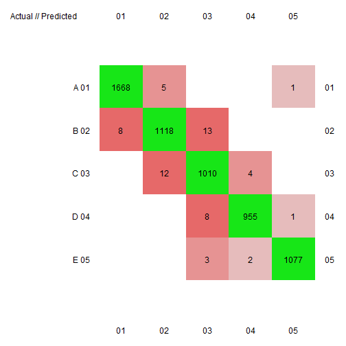

# Qualitative Prediction of Weight Lifting Exercises
### Introduction

This report aims to use data collected by Velloso et al. (2013) in order to qualitatively assess the effectiveness of a weight lifting activity. Velloso et al. utilized a wide variety of sensors on participants to gather motion data in a wide variety of formats. In total, 160 unique features were recorded per 2.5 second sliding window while participants were performing one of four common errors or performing the activity correctly.

This report aims to decipher this data in order to accurately predict whether the participant was correctly performing the activity, or exactly which way he was making an error. Thus, this method hopes to provide participants with real time feedback towards improving technique.


### Data Processing

#### Importing and Tidying Data

The first step in this process is importing the data into R. The top 17 features were selected according to a sorting algorithm. In this report, the same features were utilized to provide a concise set of explanatory features. These features are listed below.

```r
## Start'er Up
library(caret)
set.seed(1234)

## Importing the data
rawData <- read.csv("pml-training.csv", na.strings=c("NA",""), strip.white=T)

## Subset for features in paper
features <- c("roll_belt","pitch_forearm","yaw_belt","magnet_dumbbell_y","pitch_belt","magnet_dumbbell_z","roll_forearm",
              "accel_dumbbell_y","roll_dumbbell","magnet_dumbbell_x","accel_forearm_x","magnet_belt_z","total_accel_dumbbell",
              "magnet_forearm_z","accel_dumbbell_z","magnet_belt_y","accel_belt_z","yaw_arm","gyros_belt_z","magnet_belt_x","classe")   

validData <- rawData[,features]
```

```r
names(validData)
```

```
##  [1] "roll_belt"            "pitch_forearm"        "yaw_belt"            
##  [4] "magnet_dumbbell_y"    "pitch_belt"           "magnet_dumbbell_z"   
##  [7] "roll_forearm"         "accel_dumbbell_y"     "roll_dumbbell"       
## [10] "magnet_dumbbell_x"    "accel_forearm_x"      "magnet_belt_z"       
## [13] "total_accel_dumbbell" "magnet_forearm_z"     "accel_dumbbell_z"    
## [16] "magnet_belt_y"        "accel_belt_z"         "yaw_arm"             
## [19] "gyros_belt_z"         "magnet_belt_x"        "classe"
```

#### Partitioning Data

The data set provided was further split into a training and test set in order to accurately measure the out of sample error rate. This training set is comprised of 70% of the total data while having an equal ratio of all possible outcomes in both the training and test set.


```r
## Separate out training and test set
inTrain <- createDataPartition(validData$classe, p=0.7, list=F)
training <- validData[inTrain,]
testing <- validData[-inTrain,]
```

#### Random Forest Model Building

This report utilizes a random forest method to build a model, similar to the model built by Velloso et al. However, this model utilized only 4-fold cross validation while allowing for parallel processing to improve speed. These approaches help in order to provide users with real time information to correct any errors while perform the activity.


```r
## Making a random forest model
ctrl <- trainControl(allowParallel=T, method="cv", number=4)
model <- train(classe ~ ., data=training, model="rf", trControl=ctrl)
```

### Results
#### Validation
The model was then tested against the test data set to determine how accurately it could predict the type of activity. Here, we can see that the out of sample accuracy of this model is just over 99%. Thus, this model can, with sufficient accuracy, determine the quality of a particular weight lifting activity in near real time.

```r
## Testing the accuracy on the testing set
pred <- predict(model, newdata=testing)
cm <-  confusionMatrix(pred,testing$classe)
conf <- confusion(pred,testing$classe)
## Accuracy
cm$overall[1]
```

```
##  Accuracy 
## 0.9903144
```

```r
confusionImage(conf,sort=F,numbers=T,ncols=11,cex.axis=NULL,grid.col=NULL)
```

 

#### Testing Data
This segment will attempt to predict the appropriate class of the 20 observations provided in the testing data set. These were deemed to be 100% accurate when submitted into Coursera.

```r
realtest <- read.csv("~/Coursera/MachineLearning/testing/pml-testing.csv", na.strings=c("NA",""), strip.white=T)


features <- c("roll_belt","pitch_forearm","yaw_belt","magnet_dumbbell_y","pitch_belt","magnet_dumbbell_z","roll_forearm",
              "accel_dumbbell_y","roll_dumbbell","magnet_dumbbell_x","accel_forearm_x","magnet_belt_z","total_accel_dumbbell",
              "magnet_forearm_z","accel_dumbbell_z","magnet_belt_y","accel_belt_z","yaw_arm","gyros_belt_z","magnet_belt_x")   

realtest <- realtest[,features]

pred <- predict(model, newdata=realtest)
pred
```

```
##  [1] B A B A A E D B A A B C B A E E A B B B
## Levels: A B C D E
```


### Citations

Velloso, E.; Bulling, A.; Gellersen, H.; Ugulino, W.; Fuks, H. Qualitative Activity Recognition of Weight Lifting Exercises. Proceedings of 4th International Conference in Cooperation with SIGCHI (Augmented Human '13) . Stuttgart, Germany: ACM SIGCHI, 2013.
Read more: http://groupware.les.inf.puc-rio.br/har#ixzz3h25TTfRo
